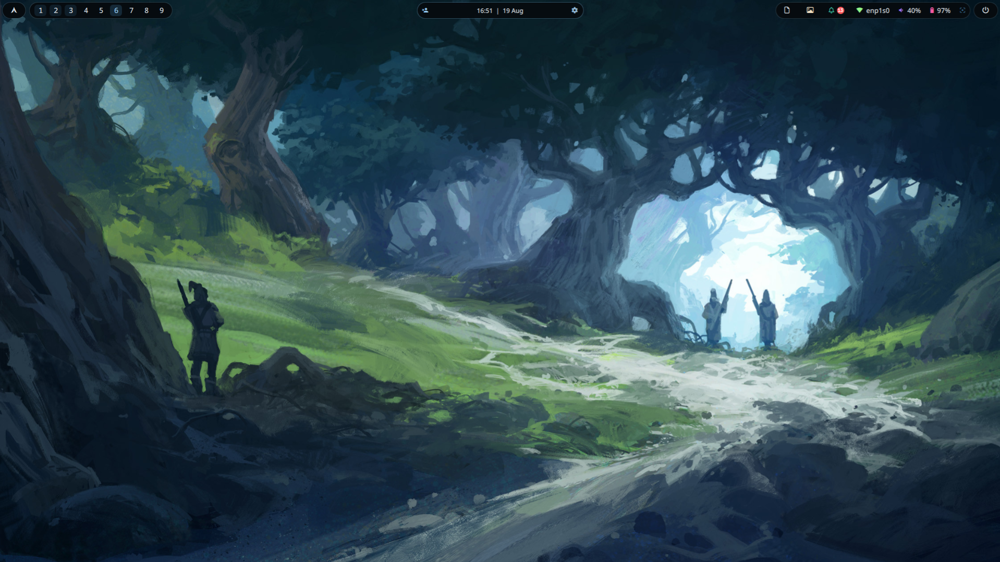
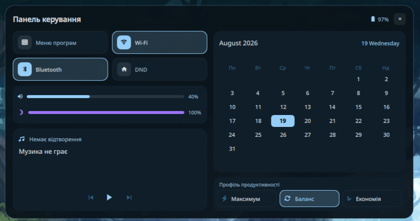

<div align="center">


# Edots-Hyprland

**Особистий Hyprland + Quickshell rice**

Кастомний нотч-бар у стилі dynamic island, шпалеро-адаптивна палітра кольорів,
GameMode, HyprGlass — усе зібрано в один дотфайл-репозиторій.

[](https://hyprland.org/)
[](https://quickshell.org/)
[](#ліцензія)

надихнувся [Dynamic-island-for-arch](https://github.com/patheonsceo/Dynamic-island-for-arch)

</div>

---

## Зміст

- [Що входить](#що-входить)
- [Скріншоти](#скріншоти)
- [Залежності](#залежності)
- [Встановлення](#встановлення)
- [Синхронізація дотфайлів (`sync.sh`)](#синхронізація-дотфайлів-syncsh)
- [HyprGlass (опційно)](#hyprglass-опційно)
- [Структура репо](#структура-репо)
- [Ліцензія](#ліцензія)

## Що входить

| Компонент | Опис |
|---|---|
| `quickshell/bar/` | Нотч-бар на Quickshell (QML): лівий острів (меню + воркспейси), центральний notch (годинник, Volume OSD, клік → Dashboard), правий острів (буфер обміну, шпалери, сповіщення, трей, мережа, звук, батарея, GameMode, живлення) |
| `quickshell/bar/Dash/` | Dashboard: Wi-Fi / Bluetooth / DND тогли, MPRIS-плеєр, календар, профілі живлення (`powerprofilesctl`) |
| `quickshell/scripts/` | `gamemode.sh` — вимикає анімації/blur/DND під час ігор; `modernmode.sh` — тогл HyprGlass через `hyprpm` |
| `hypr/` | Модульний Hyprland-конфіг на Lua (`hyprland.lua` + `modules/*.lua`), `hyprlock/`, `hypridle.conf` |
| `hypr/scripts/wallcolors.py` | Витягує палітру з поточної шпалери й генерує кольори для Hyprland, GTK, Quickshell, Kitty, Fish, Firefox |
| `gtk-3.0/`, `gtk-4.0/` | Тема GTK, синхронізована з тією ж палітрою |
| `nvim/`, `fish/`, `kitty/`, `alacritty/`, `rofi/`, `swaync/`, `fastfetch/` | Конфіги супутніх застосунків |

## Скріншоти


*Нотч-бар: воркспейси, годинник, мережа/звук/батарея, трей.*


*Dashboard: меню програм, Wi-Fi/Bluetooth/DND, гучність, MPRIS, календар, профілі живлення.*

## Залежності

- [Hyprland](https://hyprland.org/) (тестовано на `0.56.x`)
- [Quickshell](https://quickshell.org/)
- `hyprpm` — для HyprGlass (опційно)
- `swaync` — сповіщення
- Python 3 — для `wallcolors.py`
- Material Symbols Rounded — іконки в барі (AUR: `ttf-material-symbols-variable-git`, або статичний `.ttf`/`.woff2` з [fonts.google.com/icons](https://fonts.google.com/icons?icon.set=Material+Symbols&icon.style=Rounded))
- SF Pro Display — шрифт тексту/годинника в барі
- `powerprofilesctl`, `nmcli`, `bluetoothctl` — тогли в Dashboard

## Встановлення

```bash
git clone git@github.com:Edgit13/Edots-Hyprland.git ~/Dotfiles
cd ~/Dotfiles

./sync.sh install
```

`sync.sh install` сам:

1. бекапить існуючі конфіги в `~/.config-backup-<дата>/`;
2. симлінкає кожну теку/файл репо напряму в `~/.config/`;
3. виставляє `+x` на всі шел-скрипти;
4. одразу генерує палітру з поточної шпалери (`wallcolors.py`).

Далі:

```bash
qs -p ~/.config/quickshell/bar
```

## Синхронізація дотфайлів (`sync.sh`)

Раніше конфіги доводилось копіювати вручну і в `~/.config`, і назад у репо.
`sync.sh` вирішує це через **symlink**: `~/.config/hypr` і `~/Dotfiles/hypr` —
це одна й та сама тека на диску. Правиш файл з будь-якого боку — зміна одразу
і в реальному конфізі, і в git-репо, без ручного копіювання.

```bash
./sync.sh install   # створити/оновити symlink'и (з бекапом старого)
./sync.sh status    # перевірити, що і куди залінковано
./sync.sh unlink    # прибрати symlink'и (бекапи лишаються в ~/.config-backup-*)
```

Що лінкується: `alacritty`, `fastfetch`, `fish`, `gtk-3.0`, `gtk-4.0`, `hypr`,
`kitty`, `nvim`, `quickshell`, `rofi`, `swaync`, а також файли `dolphinrc` і
`kdeglobals`. Список тек/цілей редагується прямо в масиві `LINKS` на початку
скрипта.

> `firefox/chrome/` лінкується окремо, бо шлях до профілю унікальний:
> ```bash
> ln -sf ~/Dotfiles/firefox/chrome ~/.mozilla/firefox/<профіль>.default-release/chrome
> ```

## HyprGlass (опційно)

```bash
hyprpm add https://github.com/hyprnux/hyprglass
```

Потрібен дозвіл на завантаження плагінів без запиту пароля щоразу —
розкоментуй у `hypr/hyprland.lua`:

```lua
hl.permission("/usr/(bin|local/bin)/hyprpm", "plugin", "allow")
```

і повністю перезапусти Hyprland-сесію (не просто `hyprctl reload`).

## Структура репо

```
Edots-Hyprland/
├── sync.sh              # symlink-синхронізатор
├── hypr/                # Hyprland (Lua) + hyprlock/hypridle + wallcolors.py
├── quickshell/bar/       # нотч-бар (QML)
├── quickshell/scripts/   # gamemode.sh, modernmode.sh
├── gtk-3.0/ gtk-4.0/     # GTK-тема
├── kitty/ alacritty/     # термінали
├── fish/                # шел
├── nvim/                # LazyVim-конфіг
├── rofi/                # лаунчер
├── swaync/               # сповіщення
├── fastfetch/            # system-info
├── firefox/chrome/       # userChrome.css
└── docs/                 # банер, скріншоти
```

## Ліцензія

MIT
